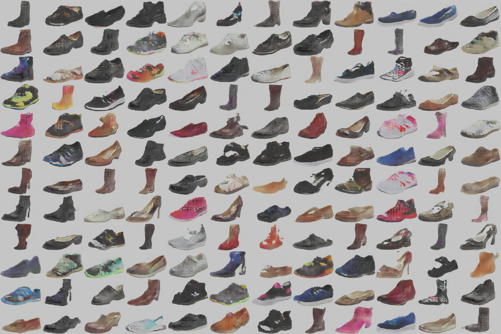

# gan-image-similarity
InfoGAN inspired network trained on images from zap50k. This network is using continuous latent codes + noise as input to the generator.
For the image similarity part, I extract the features of last layer before the classification layer of the discriminator for all images and calculate the l2 distances. 

## Installation

This project is using the following python packages:
```
tensorflow==0.11.0rc0
scipy==0.18.1
```

You will also need zap50k dataset:

`wget http://vision.cs.utexas.edu/projects/finegrained/utzap50k/ut-zap50k-images.zip`


## Training

To train the network on all the images: 
`python main.py --logdir=logs/exp1 --batch_size=128 --file_pattern="ut-zap50k-images/*/*/*/*.jpg"`

To generate the intermediate features of all the images and calculate similarity for randomly picked images:
`python main.py --similarity --batch_size=128 --logdir=logs/exp1 --file_pattern="ut-zap50k-images/*/*/*/*.jpg"`

To get images from the generator:
`python main.py --logdir=logs/exp1 --sampledir=samples`

## Results
For each line, the first image is the seed and the rest are most similar images according to l2 distance of the intermediate features.


Samples from the generator after a coulpe of epochs.

